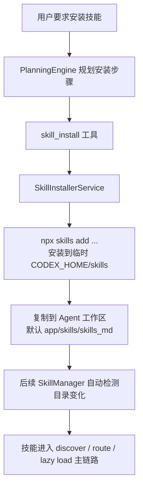
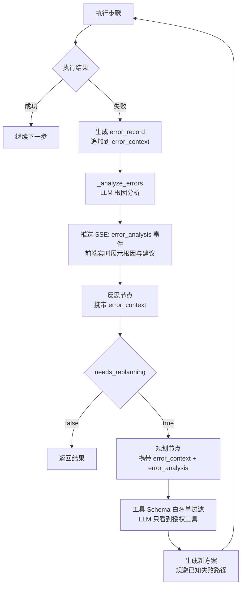
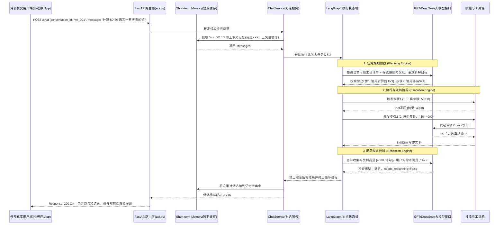
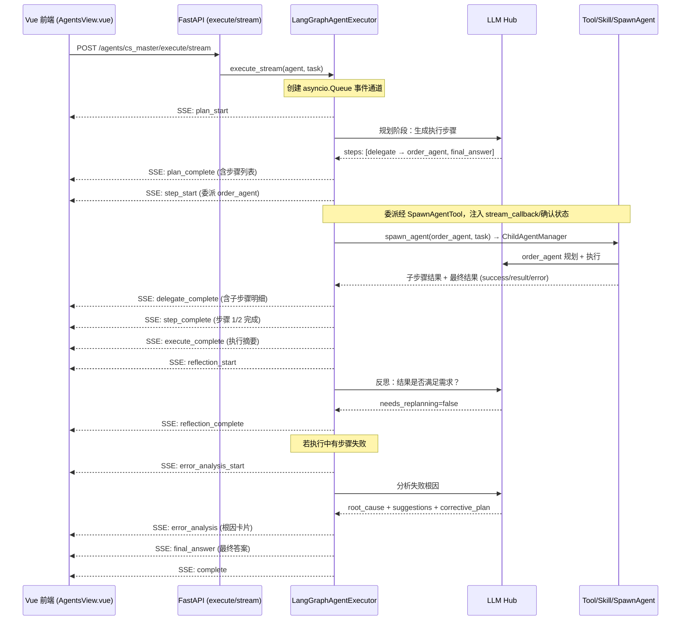

# AI Agent 智能体框架项目

这是一个高度模块化、基于 FastAPI 和 LangGraph 的全流程 AI Agent 智能体框架项目。从底层 LLM 接口适配，到独立工具库（Tools）、技能库（Skills）、工作流编排（Workflows），再到完整的任务规划（Planning）、执行（Execution）、反思（Reflection）和子节点委派，最终通过 RESTful API 提供 Chat Service 与 Automation Service。为了兼顾传统的存储与爬虫能力，本项目内部同样融合了完整的 SQLAlchemy + Alembic 关系型数据流驱动。

## ⚙️ 集成框架与技术栈

本项目主要基于 Python 3.13 并在 `pyproject.toml` 中通过 `poetry` 声明了以下核心集成框架：

1. **FastAPI (`fastapi`, `uvicorn`)**: 现代、快速的 Web 框架，用于构建提供外界调用的 RESTful API 端点。它基于标准的 Python 类型提示，提供自动文档生成（ Swagger UI ）和高性能并发响应。
2. **LangGraph (`langgraph`)**: 构建基于图模型的有状态、多 Action 的 Agent 执行环。它使得智能体的大脑（规划、执行武器库、自我推理纠错）形成一套可闭环的有向无环图流动。
3. **大模型 SDK适配 (`openai`, `anthropic`)**: 原生集成了主流大模型供应方的底层 SDK ，屏蔽底部各家大模型的协议差异。
4. **数据库与 ORM (`sqlalchemy`, `alembic`, `mysql-connector-python`)**: Python 乃至业界最成熟的 SQL 工具包和数据库迁移管理流，使得项目具备保存复杂上下文记录和历史兼容的 MySQL 表结构管理能力。
5. **基础工程化组件**:
   - **`pydantic`, `pydantic-settings`**: 数据验证和应用配置结构化管理。
   - **`python-dotenv`**: 环境变量自动加载。
   - **`httpx`**: 现代化的 HTTP 客户端，支持异步网络访问（常用于内部 Tool 中发起外部请求）。
   - **`cachetools`**: 简易高效的进程内缓存管理，极大地提高了接口对冷热数据的响应速度。
   - **`loguru`, `colorama`**: 现代化的日志处理与彩色控制台输出，为庞大的服务调用与 LLM 思维链执行提供极为清晰的中文溯源记录。

## 📂 项目结构描述

```
.
├── alembic/              # 数据库迁移相关文件
│   ├── env.py           # Alembic环境配置
│   ├── script.py.mako   # 迁移脚本模板
│   └── versions/        # 迁移版本文件
├── app/                  # 应用程序核心逻辑代码
│   ├── api/              # 对外暴露的 API路由端点集合 (入口)
│   │   └── endpoints/   # 具体的各类业务路由 (chat, agents, skills, workflows等)
│   ├── agents/           # 包含由多大模型驱动的引擎模块
│   │   ├── library/     # 预置的专家类型代理配置实例代码区
│   │   ├── planning.py, execution.py, reflection.py #核心步骤流引擎
│   │   └── langgraph_executor.py # 图驱动调度与错误分析
│   ├── channels/         # 可扩展的多终端渠道适配接入模块层 
│   ├── config/           # 配置模块
│   ├── core/             # 系统核心设置与日志引擎 (Loguru) 初始化
│   ├── db/               # SQLAlchemy 数据库连接器与引擎
│   ├── decorators/       # API 函数缓存等通用装饰器
│   ├── llm_hub/          # 底层 LLM 提供者核心工厂
│   │   ├── providers/   # 不同的厂商适配文件 (OpenAI, Anthropic 等)
│   │   ├── inference.py, prompt_builder.py # 通用大模型流式推理与提示词生成封装
│   ├── memory/           # 记忆力管理层 (如 运行级详尽记忆与会话级任务摘要提取)
│   ├── middleware/       # 拦截器与自定义异常处理器 (含报错美化格式转换)
│   ├── models/           # 数据库模型对象 (ORM 映射定义)
│   ├── schemas/          # Pydantic 校验模型层 (统一通信数据结构)
│   ├── scripts/          # 用于不同环境下快捷切换 DB 与构建数据表的运维脚本
│   ├── services/         # 面向外部的业务总线层接口服务
│   ├── skills/           # 通过大语言模型做二次包装的高级技能库统筹 
│   │   ├── installer.py # 技能安装服务（统一处理 Skills CLI 安装与工作区落地）
│   │   ├── manager.py   # 动态技能管理器（扫描/路由元信息/懒加载）
│   │   ├── skills_md/   # 默认技能源码/安装工作区（可由 AGENT_WORKSPACE_DIR 配置覆盖）
│   │   └── library/     # 历史兼容目录（逐步迁移中）
│   ├── tools/            # Python 硬编码底层能力库封装框架
│   │   └── builtin/     # 内置计算器、爬虫、系统时间获取等真实工具代码执行区
│   ├── utils/            # 通用工具与辅助函数库（含提示词管理与路径解析）
│   ├── prompt/           # 外置提示词模板（按模块拆分：plan/reflection/langgraph/execution）
│   ├── workflows/        # 写死了拓扑链路和节点跳转条件的工作流集合
│   │   ├── templates/   # 存放在系统中供任意提取的通用工作流程拓扑结构图
│   └── main.py           # FastAPI 服务器核心入口
├── docs/                 # 项目核心文档区（架构设计、任务实施排期、Bug记录等）
├── tests/                # 集成测试与全链路推演保障目录
├── web/                  # 前端 Web 管理界面 (Vue 3 + Vite + Element Plus)
├── AI_WORKSPACE.md       # 针对 AI 代码助手的全局约束和开发纪律工作区配置
├── pyproject.toml        # Poetry 依赖和元数据配置文件
├── run.sh                # 便捷的一键运行环境部署执行脚本
├── .env                  # 运行所需的所有核心环境变量注入点
└── run_app.py            # 面向本地调试和生产部署包装过的 Uvicorn 应用启动脚本
```

## 💡 核心全景架构

这里的架构图展现了工程中内部模块的层级调用和请求流向：

```mermaid
graph TD
    %% 用户层
    User((外部真实用户 / 前端 / 客户端))
    
    %% API 接口层
    subgraph APILayer ["REST API 中枢点 (app/api)"]
        API_Chat["POST /api/v1/chat (基础通用多轮对话)"]
        API_Agent["POST /api/v1/agents/{id}/execute (指定专门Agent执行)"]
        API_AgentStream["POST /api/v1/agents/{id}/execute/stream (流式执行+SSE轨迹推送)"]
        API_Workflow["POST /api/v1/workflows/... (定式流程引擎执行)"]
        API_Skill["POST /api/v1/skills/{id}/execute (特定AI技能独立调用)"]
        API_Config["GET /tools, /skills, /agents (配置化获取平台能力)"]
    end
    
    %% 服务层
    subgraph ServiceLayer ["核心业务服务层 (app/services)"]
        ChatService["Chat Service (多轮对话记忆组装服务)"]
        AutomationService["Automation Service (自驱智能执行服务)"]
        LangGraph["LangGraph Executor (图驱多状态机调度总线)"]
    end
    
    %% Agent 引擎层
    subgraph AgentEngine ["Agent 引擎系统 (app/agents)"]
        Planning["Planning Engine (规划编排)"]
        Execution["Execution Engine (动态决定调用动作库)"]
        Reflection["Reflection Engine (对结果进行检验拦截并驱动重试)"]
        ChildMgr["Child Agent Manager + SpawnAgentTool (委派统一经工具层，透传流式与确认)"]
    end
    
    %% 技能库与工具库
    subgraph CapabilityLayer ["智能载荷库 (app/tools, app/skills)"]
        ToolHub["Tool Hub (查时间/计算器等确定性逻辑)"]
        SkillManager["Skill Manager (Metadata 路由 + 懒加载执行)"]
    end
    
    %% 核心基础设施
    subgraph InfraLayer ["大模型基座与基础设施 (app/llm_hub, app/memory)"]
        LLMHub["InferenceEngine (大模型路由网关)"]
        Memory["Memory System (运行级记忆与会话级摘要)"]
    end
    
    %% 数据流向
    User -->|发送 JSON| APILayer
    APILayer -->|组装/路由| ServiceLayer
    ServiceLayer -->|分配工作图计算节点| AgentEngine
    AgentEngine -->|编排/调用| CapabilityLayer
    AgentEngine -->|生成/推理| InfraLayer
    CapabilityLayer -->|依赖解析| InfraLayer
```



## 🧠 技能系统重构（动态加载模式）

当前技能系统已完成从"代码硬注册"向"文件系统动态加载"的升级，核心链路如下：

1. **技能发现**：`SkillManager.discover_skills()` 扫描 Agent 工作区中的 `*/SKILL.md`，默认目录为 `app/skills/skills_md`，也可通过 `.env` 中的 `AGENT_WORKSPACE_DIR` 覆盖，构建轻量元数据索引。  
2. **意图门禁过滤**：`_filter_intent_restricted_skills()` 对受限技能（如 skill-creator、dynamic_probe）做意图感知门禁，避免普通任务误召回高影响技能。  
3. **工具兼容性过滤（二元组）**：`_filter_tool_incompatible_skills()` 返回 `(compatible_skills, incompatible_skills)` 二元组：
   - `compatible_skills`：当前 Agent 工具满足要求 → 进入规划候选集，对 LLM 可见  
   - `incompatible_skills`：系统中存在但当前 Agent 工具不足 → 对 LLM **不可见**，但规划层保留引用用于委派检测  
4. **工具不兼容技能点名委派（框架级）**：若用户明确点名了某个 `incompatible_skills` 中的技能（如"请使用 find-skills 技能"），且当前 Agent 具备 `spawn_agent + general_agent` 委派能力，则直接构造委派计划跳过 LLM 规划，由 `general_agent` 代为执行，而不是向用户宣称"该技能不存在"。此机制适用于所有协调型 Agent 与所有工具受限技能。  
5. **混合路由（规则预筛 + LLM 决策）**：`langgraph_executor._route_skills_by_metadata()` 先做规则打分筛选 Top-K（仅对 compatible_skills），再由 LLM 在候选集中做最终技能决策。  
6. **动态加权规则**：`skill_boost_rules` 不再写死；系统基于 `skill_id/name/tags/inputs/when_to_use/description` 自动构建关键词加权规则，并对跨技能高频通用词做抑制。  
7. **规划阶段**：Planning Prompt 只看到候选技能的元信息，不加载技能正文；LLM 决定是否调用技能、调用哪个技能及参数。  
8. **执行阶段**：`ExecutionEngine._execute_skill()` 通过 `skill_manager.get_skill()` 懒加载目标技能全文与资源。  
9. **工具收敛**：技能执行时按 `required_tools/optional_tools`、Agent 工具白名单、敏感工具过滤、用户拒绝工具过滤进行交集收敛，降低工具循环风险。  
10. **安装闭环**：当任务目标是"安装技能"时，系统优先使用内置 `skill_install` 工具，经 `SkillInstallerService` 调用 Skills CLI，将安装结果先落到临时 `CODEX_HOME/skills`，再复制到 Agent 工作区；后续 `SkillManager` 在下一次访问时会自动检测目录变化并重载索引。

> 说明：详细重构方案见 [docs/skills_reload.md](docs/skills_reload.md)。

### 技能安装与工作区

- **统一技能源码工作区入口**：`.env` 中新增 `AGENT_WORKSPACE_DIR`，当前默认值为 `app/skills/skills_md`。该目录用于技能安装结果落地、技能扫描与技能源码读取，是技能的静态工作区。
- **运行产物目录与技能源码目录分离**：技能执行过程中若需要生成 JSON、临时文件、导出文件或其它运行态资产，统一写入 `workspace/artifacts/skills/<skill_id>/`，而不是回写到技能源码目录。
- **安装优先走结构化工具**：安装技能时不再推荐让 LLM 自由拼接 `shell_exec` 命令，而是优先使用 `skill_install` 工具。
- **兼容历史命令**：若历史记忆或用户输入中仍出现 `npx skills install ...`，安装服务会自动规范化为 `npx skills add ...` 后再执行。
- **与动态加载衔接**：技能被复制到工作区后，不需要手动改代码；`SkillManager` 会在下一次 `list_skill_metadata()` / `load_skill()` 时自动感知目录变化并刷新索引。
- **分离原因**：技能一旦安装完成，默认应视为稳定输入；运行态产物外置到 `workspace/artifacts`，可以避免技能源码被污染，降低"技能安装后又被执行过程改写"的架构风险。



### 会话记忆与跨轮安装候选

- **摘要来源不只看结论**：每轮任务结束后，`extract_summary_from_run_memory()` 会同时读取 `final_result`、`step_results` 与最终反思，除了保留人类可读 `summary`，还会额外提炼 `actionable_facts`（如 `owner/repo@skill`、`npx skills add ...`、URL、资源 ID、文件路径）。
- **跨轮传递保留双形态**：`TaskSummaryEntry.to_context_message()` 不只写一段自然语言结论，还会同时写入“`label -> value`”映射文本与紧凑 JSON，便于 LLM 直接理解，也便于公共层后续反向提取结构化事实。
- **主/子 Agent 统一挂回同一轮主线**：会话摘要新增 `conversation_turn_id`、`source_user_task`、`entry_scope`。同一轮里的主 Agent 与子 Agent 摘要会被聚合到同一个“用户主线问题”下，而不是把子任务误记成新的用户问题。
- **历史追问走会话主线回顾**：当用户问“我的第一个问题是什么”“之前说过什么”“继续刚才那个”这类元历史问题时，公共层会按 `conversation_turn_id` 构造 `【会话主线回顾】` 时间线给 LLM，而不是只靠关键词匹配某一条零散摘要。
- **仅在安装类任务中激活候选提炼**：当新一轮任务属于“安装技能”时，`langgraph_executor._build_history_guided_install_context()` 会从会话摘要中提取并打分历史事实，生成 `history_install_candidates` 注入 Planning 上下文。
- **候选不是硬编码短路**：这些候选只作为高价值参考，不会在框架层强制改写为单步 `skill_install`；若用户当前回合明确要求“先搜索”“从 GitHub 找”“手动下载/解压”，规划仍应优先满足该过程性意图。

### 规划输出恢复与结果复用边界

- **轻度 JSON 漂移兼容**：规划解析公共层兼容轻度格式漂移，例如 Python 字面量风格、尾逗号、包裹在 Markdown 或 `<think>` 中的 JSON 片段，避免把本可恢复的结果直接判成失败。
- **截断型恢复**：当规划结果疑似因长度被截断时，统一走 `retry_after_length` 做短计划重试。
- **非截断型结构修复**：当规划结果不是有效 JSON、但又不是截断问题时，统一走 `repair_after_invalid_json` 仅修复结构，不重新发散规划语义，减少中间轨迹出现“解析计划失败”的假 `final_answer`。
- **上游空白响应恢复**：当底层供应商返回 `choices=None/[]` 且缺少明确错误码/错误消息时，Provider 公共层会按“瞬时空白响应”自动短退避重试，避免把短暂网关抖动直接升级成规划失败、反思失败或答案合成失败。
- **上游结果复用硬约束**：若后续步骤需要继续处理上一步工具/技能/委派返回的 HTML、文本或 JSON，必须通过 `{{last_tool_result}}`、`{{last_tool_result.content}}`、`{{last_delegate_result}}` 等占位符复用上游结果；禁止在 `python_executor` 中手工重写上游样本数据。
- **历史安装引用的使用边界**：会话记忆中提炼出的 `owner/repo@skill` 等精确安装引用，只作为规划阶段的高价值候选注入给 LLM；框架层不再直接把首轮计划短路成 `skill_install`。是否直接复用、还是先搜索/先走 GitHub/先下载压缩包，由 LLM 结合当前任务表述与历史上下文自主决策。
- **安装 fallback 的路径边界**：若安装任务退回到 `http_request` / `archive_extract` / `file_write` 等结构化步骤，必须复用上一步真实返回的 `download_path` 等路径，并且目标目录必须是 `AGENT_WORKSPACE_DIR` 对应的真实工作区；禁止臆造 `/tmp/*.zip`、`/app/skills/skills_md/...` 等假路径。
- **长结果摘要边界**：在 Reflection / 重规划等需要“控长”地回看上一轮结果的场景，系统不再只保留结果开头，而是统一使用“首尾保留 + 中间省略说明”的摘要策略；这样既能控制 Prompt 体积，也能避免列表/表格类答案因尾部被隐藏而被误判成“传输截断”。

### 最终答案公共收口

- **执行结果优先走公共收口层**：`final_answer` 不再假设必须经一次额外 LLM 合成后才能返回。执行引擎会先判断是否属于“单一上游结果已足够面向用户”的场景。
- **单一结果跳过二次合成**：若本轮只有一个成功的 `skill` 或 `delegate` 结果，且该结果本身已具备可读内容，则直接走确定性 Markdown 收口，减少额外延迟和供应商空回复风险。
- **合成失败统一 Markdown 降级**：当多步骤结果仍需要 LLM 合成，但合成阶段失败时，公共层会把已完成步骤统一渲染成标准 Markdown，而不是原始字符串拼接。
- **SSE / 非流式共享同一结果**：真实最终答案会回写到 `final_answer` 步骤结果，并经 `final_result` 公共清洗后同时供 SSE `step_complete`、SSE `final_answer`、会话摘要提取和下一轮历史注入复用。


## 🛡️ 错误感知与自我纠错机制

本项目实现了一套完整的 **LLM 错误感知自我纠错（Error-Aware Self-Correction）** 架构，核心解决"Agent 反复尝试被禁止的操作"问题。

### 工作原理



### 核心防线：工具 Schema 双层过滤 + Reflection 信息补全

**规划引擎向 LLM 传递 function calling 工具列表时，执行两层独立过滤**，同时将规划阶段工具调用结果写入 `run_memory`，消除 Reflection 信息盲区：

**第一层：Agent 白名单过滤**（"是否授权给该 Agent"）

| 位置                    | 机制                                                      | 效果                             |
| ----------------------- | --------------------------------------------------------- | -------------------------------- |
| `planning.py`           | `available_tools` 白名单过滤全量 `tool_hub.get_schemas()` | LLM 完全看不到未授权工具         |
| `reflection.py`         | 同上，`reflect()` 增加 `available_tools` 参数             | 反思阶段也不会建议使用禁用工具   |
| `langgraph_executor.py` | `_analyze_errors()` 生成结构化根因分析                    | 为重规划提供准确的错误原因与建议 |

**第二层：`planning_safe` 副作用过滤**（"是否允许在规划 loop 中直接调用"）

规划 LLM 在生成 JSON 计划前，会进入内部 tool-calling loop 调用工具搜集信息。第二层过滤只允许无副作用的只读工具进入该 loop，防止副作用工具绕过 Execution Node 在规划阶段被直接执行：

| `planning_safe` 值 | 含义                             | 代表工具                                                              |
| ------------------ | -------------------------------- | --------------------------------------------------------------------- |
| `True`（默认）     | 只读探查工具，可在规划 loop 调用 | `search`、`http_request`、`file_read`、`list_dir`、`calculator`       |
| `False`            | 有副作用，只能在执行阶段调用     | `skill_install`、`shell_exec`、`file_write`、`python_executor`、`browser`、`send_message`、`spawn_agent` |

> 新增工具时，若有磁盘写入、命令执行、网络写入等副作用，必须在工具类上声明 `planning_safe: bool = False`。

**规划阶段工具调用写入 run_memory**（消除 Reflection 信息盲区）

规划 loop 中调用工具的结果同步写入 `AgentRunMemory`（`entry_type="plan_tool_call"`），Reflection 的 `build_messages_for_reflection()` 通过 `iteration <= current_iteration` 条件自动包含这些记录，消除"规划阶段做了什么 Reflection 看不见"的信息盲区，防止误判触发多余重规划。

### AgentState 新增字段

```typescript
interface AgentState {
  // ...原有字段...
  error_context: ErrorRecord[];  // 历史失败步骤（跨迭代累积）
  error_analysis: {              // LLM 根因分析结果
    root_cause: string;
    suggestions: string[];
    corrective_plan: string;
  } | null;
  pending_user_inputs: Record<string, unknown>; // 待用户输入映射（key=input_request_id）
  run_memory: {
    user_inputs_cache: Record<string, Record<string, string>>;
  } | null; // 任务级运行记忆（含用户输入缓存）
}
```

### SSE 错误事件

| 事件                   | 时机              | 前端展示                                           |
| ---------------------- | ----------------- | -------------------------------------------------- |
| `step_error`           | 单步骤失败        | 🔴 红色错误卡片                                     |
| `error_analysis_start` | 开始 LLM 根因分析 | 🟠 分析中通知                                       |
| `error_analysis`       | 分析完成          | 🔴 详细根因分析卡片（含步骤、根因、建议、纠正方案） |

## 🧩 提示词架构（外置模板）

为降低 Prompt 维护成本并避免超长字符串散落在业务代码中，项目已将核心 Agent 提示词抽离为外置模板，并采用 Jinja2 渲染：

- **模板目录**：`app/prompt/plan`、`app/prompt/reflection`、`app/prompt/langgraph`、`app/prompt/execution`
- **管理器**：`app/utils/prompt_manager.py`（统一加载、缓存、渲染，`StrictUndefined` 防止变量漏传）
- **路径解析**：`app/utils/resource_path.py`（统一从项目根解析资源路径）
- **稳定性策略**：
  - 关键模板在引擎初始化时尝试预加载，尽早暴露配置问题
  - 执行链路保留“模板渲染失败 -> 内置提示词回退”兜底，避免主流程中断

## 💬 交互式消息与行为反馈设计

本项目采用统一的交互与反馈机制，确保 Agent 的思考过程透明且能与用户实时互动：

- **主动收集输入**：当大模型判断需用户提供必选参数（如邮箱、配置等）方可执行后续工具或代码时，通过 `send_message` (message_type='input') 唤起前端表单。
- **操作安全确认**：高危或敏感操作前，通过 `send_message` (message_type='confirm') 等待用户授权，结合 `confirm_id` 实现执行流的精准挂起与唤醒。
- **状态与进度透传**：
  - **中间状态**：Agent 的思考 (Thinking)、反思 (Reflection)、计划 (Planning) 及执行 (Execution) 均会通过消息通道推送摘要。
  - **反馈进度**：即使无需用户输入，Agent 也会定期发送中间进度或执行轨迹。
- **用户决策选择**：支持下发选项 (Options)，由用户决定后续的业务分支逻辑。
- **上下文自动注入**：执行引擎在调用交互工具前，会自动注入 `stream_callback`、`pending_confirmations`、`pending_user_inputs`、`run_memory.user_inputs_cache` 与 `iteration`，保证跨 Agents 委派时交互行为一致，且输入事件可正确挂起/唤醒并标记到对应迭代。
- **防重复询问机制**：当用户已经提供 SMTP/数据库等配置后，会写入 `run_memory.user_inputs_cache`；后续 `python_executor` 优先命中缓存并跳过重复弹窗。SMTP 预检查仅校验 SMTP 相关字段，避免被业务数据（如 `customer_email=xxx@example.com`）误判。

## 🧪 内置客服 + 订单查询 Demo

本项目内置了一组完整的客服场景 Agent 与订单演示数据，方便直接体验“主 Agent 协调 + 子 Agent 落地执行 + 数据库查询”的全流程能力：

- **客服主 Agent（`cs_master`，客服总监）**
  - 职责：只做**问题分类、任务委派、结果整合与对话输出**。
  - 工具权限：仅授权 `datetime`，**没有** `database_query` 等业务工具。
  - 协作策略：遇到订单 / 配送 / 退款等问题时，必须委派给对应子 Agent（`order_agent`、`refund_agent`），自己只负责向用户说明与总结。

- **订单子 Agent（`order_agent`，订单专员）**
  - 职责：订单详情查询、订单状态、配送跟踪、商品明细等；若任务含“写入本地”等自身工具无法完成的部分，会通过 **spawn_agent** 委派给 `general_agent` 完成。
  - 工具权限：授权 `database_query`、`http_request`、`datetime`、**spawn_agent**，可以直接访问内存订单数据库。

- **退款子 Agent（`refund_agent`，退款专员）**
  - 职责：退款申请、退款审核、退款进度查询。
  - 工具权限：授权 `database_query`、`calculator`、`datetime`。

- **通用助手（`general_agent`）**
  - 职责：处理搜索、文件写入、代码执行、翻译等通用任务；常被 `order_agent` / `refund_agent` 委派完成“写入本地”“搜索参数”等衍生需求。
  - 工具权限：授权 `search`、`http_request`、`python_executor`、`file_read`/`file_write`/`file_edit`、`list_dir`、`archive_extract`/`archive_compress`、`skill_install`、`shell_exec`、`calculator`、`datetime`、`send_message` 等，无 `spawn_agent`。

- **内存订单数据库 + `DatabaseQueryTool`**
  - 启动时自动构建 SQLite 内存库，包含 `customers / products / orders / order_items / refunds` 等表，并注入 1001–1010 号订单等测试数据。
  - `DatabaseQueryTool` 会在数据注入后自动读取 Schema，将**表结构与字段信息拼接到工具描述中**，确保大模型可以根据真实列名生成合法 SQL（仅允许 `SELECT`）。
  - 成功启动后日志中会看到类似：
    - `[工具初始化] 订单测试数据已注入内存数据库，Schema 已同步到工具描述，Agent 现在可以查询订单 1001-1010`

- **委派机制**：子 Agent 委派**统一经 SpawnAgentTool（`spawn_agent`）** 执行：规划中的 `action: "delegate"` 由执行引擎转为调用该工具，并注入 `stream_callback`、`pending_confirmations`、`pending_user_inputs`、`run_memory`（含 `user_inputs_cache`）等，保证子 Agent 的 SSE 轨迹、用户确认与用户输入行为与主 Agent 一致；失败时兜底为直接调用 ChildAgentManager。

- **典型调用示例**
  - 请求：`POST /api/v1/agents/cs_master/execute` 或 `POST /api/v1/agents/cs_master/execute/stream`
  - Body 示例：
    ```json
    {
      "task": "帮我查询订单号 1002 的详细情况，包括商品、客户和配送状态，并写入本地文件。"
    }
    ```
  - 执行流程（简化）：
    1. `cs_master` 识别为订单类问题 → 通过 **spawn_agent** 委派给 `order_agent`（任务描述含“写入本地”）
    2. `order_agent` 使用 `database_query` 查询订单 + 客户 + 商品明细，再通过 **spawn_agent** 委派给 `general_agent` 将结果写入本地文件
    3. 执行引擎将各层结果传回，由 LLM 合成带真实字段值与文件路径的最终回复

## 🚀 外界真实系统调用全流程解密

为了让企业应用、前端页面或微信小程序等使用者可以无缝与 Agent 对接，API 层被设计成了高度解耦的方法。当外界只想要简单的能力时可以走简单通道，想要复杂的反思推演逻辑时则会自动落入引擎管道内。

### 详细业务运转与调用图

以下序列图揭示了当一个自然语言提问抛过来时，整个系统是怎么协同配合帮用户得到解答的：



### 具体 API 端点调用说明

系统启动后，访问 `http://localhost:8002/docs` 可以看见全部自动生成的 OpenAPI Swagger 文档。下面列出了系统目前对外提供的**所有主要 API 端点**及它们的详细调用方法：

#### 一、 Chat 对话类接口 (最通用)
这类接口最适合大部分常规产品（如智能客服、微信机器人的自然语言接入），涵盖了记忆保持并且无需前端自己拆分逻辑。

1. **基础综合对话 (非流式)**
   - **请求端点**: `POST /api/v1/chat`
   - **作用介绍**: 给定当前 `conversation_id` 与提问，系统进行完整的思考、调用工具并一次性返回最终组装好的答案。
   - **请求体示例**: 
     ```json
     {
       "conversation_id": "user_12345", 
       "message": "你好，帮我查一下今天的日期并算一下 100 * 50", 
       "model": "deepseek-v3.2" 
     }
     ```
   
2. **打字机流式对话 (Streaming)**
   - **请求端点**: `POST /api/v1/chat/stream`
   - **作用介绍**: 与上面的基础对话逻辑完全一致，但响应格式为 Server-Sent Events (SSE) 流式返回。适合在网页前端实现“Token 逐字打印”的动态效果。
   - **请求体示例**: 同 `POST /api/v1/chat`。

3. **清空短期记忆上下文**
   - **请求端点**: `DELETE /api/v1/chat/{conversation_id}`
   - **作用介绍**: 主动遗忘特定 `conversation_id` 此前的多轮对话内容，开启全新的话题。无请求体。

#### 二、 Agent 代理引擎接口
当你不需要聊天，而是需要派发一个明确的**专业任务**给系统后台的某个特定专家 (Agent) 时使用。

4. **指定专家 Agent 执行深度任务（非流式）**
   - **请求端点**: `POST /api/v1/agents/{agent_id}/execute`
   - **作用介绍**: 跳过通用对话外壳，直接唤起特定领域的 Agent 处理长耗时任务，完整结果一次性返回。
   - **请求体示例**:
     ```json
     {
       "task": "请对该段代码 `print('hello')` 进行规范评审",
       "config": {"execution_model": "gpt-4"}
     }
     ```

5. **指定专家 Agent 流式执行（SSE 实时轨迹推送）**
   - **请求端点**: `POST /api/v1/agents/{agent_id}/execute/stream`
   - **作用介绍**: 与端点 4 的 Agent 执行逻辑完全相同，但以 **Server-Sent Events（SSE）** 格式实时流式推送执行轨迹的每一个阶段——规划步骤、工具调用结果、子 Agent 委派进度、反思过程和最终答案，适合前端实现"Agent 思考过程实时可视化"。
   - **请求体**: 同端点 4。
   - **响应格式**（SSE，`Content-Type: text/event-stream`）:
     ```
     data: {"event": "plan_start", "iteration": 1, ...}
     
     data: {"event": "plan_complete", "data": {"steps": [...]}, ...}
     
     data: {"event": "tool_complete", "data": {"tool_name": "database_query", ...}, ...}
     
     data: {"event": "final_answer", "data": {"answer": "..."}, ...}
     
     data: {"event": "complete", ...}
     ```
   - **支持事件类型**: `plan_start` / `plan_complete` / `step_start` / `tool_start` / `delegate_start` / `skill_start` / `tool_complete` / `skill_complete` / `delegate_complete` / `step_complete` / `execute_complete` / `reflection_start` / `reflection_complete` / `error_analysis_start` / `error_analysis` / `step_error` / `user_confirm_required` / `user_confirm_result` / `sub_agent_start` / `sub_agent_end` / `final_answer` / `complete`。其中中间事件会统一做公共层清洗：去除 `<think>`、压缩超长包装对象、优先展示用户可见摘要；`step_complete` 在步骤为合成最终答案时会把真实合成文本放到 `data.result`，`final_answer` 事件仍通过 `data.answer` 提供最终答案；子 Agent 相关事件带 `is_sub_agent`、`sub_agent_id`、`sub_agent_name` 便于区块展示。

6. **用户确认敏感操作（流式执行中需确认时调用）**
   - **请求端点**: `POST /api/v1/agents/confirm/{confirm_id}`
   - **作用介绍**: 当流式执行遇到需用户确认的敏感操作（如 `file_write`）时，会先推送 `user_confirm_required` 事件并暂停，前端展示确认弹窗后调用本接口告知允许或拒绝，执行器据此继续或跳过该步骤。
   - **请求体示例**: `{"allowed": true}` 或 `{"allowed": false}`

7. **获取所有可用专家 Agent 列表**
   - **请求端点**: `GET /api/v1/agents`
   - **作用介绍**: 返回后端在 `AgentRegistry` 中注册的所有 Agent 详细信息，可用于前端构建"Agent 专家应用商店"。

8. **获取单个 Agent 详情**
   - **请求端点**: `GET /api/v1/agents/{agent_id}`
   - **作用介绍**: 查询某一个特型 Agent 的具体能力说明与默认配置。

#### 三、 Skill 技能库接口
有时不需要大模型复杂的 Planning（规划步骤），外部系统就是有一个明确的 “点击翻译此文” 按钮。可以通过此通道一键强制调用技能。

9. **强制孤立技能调用**
   - **请求端点**: `POST /api/v1/skills/{skill_id}/execute`
   - **作用介绍**: 明确跳过 Agent 规划循环，直接触发指定技能的运行时执行（适合固定按钮型场景）。
   - **执行约束**: 该入口同样会按技能 `required_tools/optional_tools` 过滤工具定义，并屏蔽敏感工具（如 `file_write`）的隐式调用。
   - **请求体示例** (以调用 `translation` 技能为例):
     ```json
     {
       "parameters": {
          "text": "Hello world",
          "target_language": "中文"
       }
     }
     ```

10. **获取所有可用技能列表**
   - **请求端点**: `GET /api/v1/skills`
   - **作用介绍**: 返回动态扫描后的可用技能清单（含参数元数据），可用于前端技能面板与参数填充。

#### 四、 Tool 工具箱层接口
底层无脑工具（例如仅包含纯 Python 代码的计算器、获取系统时间）。

11. **获取所有硬编码原子工具列表**
   - **请求端点**: `GET /api/v1/tools`
   - **作用介绍**: 通常作为展示用途，看 LLM 具备哪些最底层的可调用原子长臂。

#### 五、 Workflow 工作流接口
具有固定模式、拓扑跳转和确定性步骤判断的工作流。

12. **执行定式业务流**
    - **请求端点**: `POST /api/v1/workflows/{workflow_id}/execute`
    - **作用介绍**: 根据已定义的蓝图模板开启一次执行。
    - **请求体示例**:
      ```json
      {
         "inputs": {
             "user_query": "我要投诉网络信号差"
         }
      }
      ```

13. **获取所有的工作流拓扑列表**
    - **请求端点**: `GET /api/v1/workflows`

#### 六、 微信公众号爬虫接口 (历史扩展遗留与辅助)
兼容旧版的文章结构与搜狗搜索功能能力。

14. **搜索公众号文章**: `GET /api/v1/wx/search?query=关键词`
15. **提交处理文章列表**: `POST /api/v1/wx/articles`
16. **获取单篇文章详情**: `POST /api/v1/wx/article/detail`

## 🖥️ 前端 Web 管理界面

项目内置了一个基于 **Vue 3 + Element Plus** 的现代化前端管理界面，位于 `web/` 目录。

### 核心功能

- **Agent 列表与执行**：浏览所有可用 Agent，发起任务并实时查看执行轨迹
- **Agent 思考与执行轨迹可视化**：以时间轴卡片的形式，实时展示 Agent 执行的每一步：
  - 📋 规划阶段：可视化展示 LLM 生成的执行计划和推理过程
  - ⚡ 执行阶段：逐步展示工具调用（含数据库查询结果表格）、技能调用、子 Agent 委派（含子步骤明细）；「合成最终答案」/「合成答案」下展示后端返回的**真实合成答案**（`step_complete` 的 `data.result`，最终收口事件为 `final_answer.data.answer`）
  - 🔐 用户确认：敏感操作（如写文件）前弹出确认框，调用 `POST /agents/confirm/{confirm_id}` 允许或拒绝
  - 🔴 错误分析阶段：当步骤失败时，实时展示 LLM 根因分析卡片（根因、建议、纠正方案）
  - 🔍 反思阶段：展示反思结论与是否重新规划的决策
  - ✅ 完成阶段：最终答案的 Markdown 渲染
- **子 Agent 区块展示**：子 Agent 轨迹以区块标题区分，不同子 Agent 可配不同主题色；事件含 `sub_agent_start` / `sub_agent_end` 与 `is_sub_agent` 便于折叠/高亮。展示顺序经前端重排序：**先展示当前 Agent 的工具/技能调用，再展示其委派的子 Agent**，符合“先执行本层再委派”的阅读顺序。
- **轨迹区滚动**：用户上滑查看历史轨迹时不再强制自动滚到底部；右下角提供「回到底部」按钮，点击后滚至最新
- **阶段进度指示条**：顶部动态展示当前所在阶段（规划 → 执行 → 反思 → 完成）
- **Chat 对话**：普通多轮对话（含打字机流式效果）
- **工具/技能/工作流管理**：查看已注册的工具、技能和工作流定义

### Agent 流式执行调用时序

以下序列图展示了 SSE 流式模式下前端与后端的完整交互过程：



### 启动前端开发服务器

```bash
cd web
npm install
npm run dev
# 访问 http://localhost:5173
```

### 前端技术栈

| 框架/库      | 版本 | 用途                        |
| ------------ | ---- | --------------------------- |
| Vue 3        | 3.x  | 前端框架（Composition API） |
| Element Plus | 2.x  | UI 组件库                   |
| Vite         | 5.x  | 构建工具                    |
| Vue Router   | 4.x  | 路由管理                    |
| Marked       | 12.x | Markdown 渲染               |


## 💻 安装和运行

### 1. 环境准备与依赖安装

强烈推荐使用 `poetry` 进行现代化的 Python 包环境初始化。

```bash
# 1. 克隆代码后，在项目根目录执行它，它会读取 pyproject.toml 中的要求:
poetry install

# 2. 激活并进入其自动生成的虚拟环境终端
poetry shell
```

### 2. 环境配置设置

你需要使用你的 LLM 服务提供商的 Key 才能正常启动大模型推理引擎。
复制一份环境模板文件并把它重命名：
```bash
cp .env.example .env
```
修改里面的核心变量：
```ini
API_PREFIX=/api/v1
ENVIRONMENT=development

# 核心：大模型驱动引擎所需的秘钥
OPENAI_API_KEY=sk-xxxxxxx
OPENAI_BASE_URL='https://apis.iflow.cn/v1'
DEFAULT_MODEL='deepseek-v3.2'

# Agent 工作区（默认技能源码/安装目录）
AGENT_WORKSPACE_DIR='app/skills/skills_md'

# 数据库等配置按需修改 (如果你要用到涉及 DB 的额外组件)
DB_DRIVER=mysql+mysqlconnector
DB_HOST=localhost
DB_PORT=3306
DB_NAME=wx_public_dev
# ...
```

说明：
- 修改 `AGENT_WORKSPACE_DIR` 后，技能扫描目录和技能安装落地点会一起切换；技能运行态产物仍统一写入 `workspace/artifacts/skills/<skill_id>/`。
- 若你调整了 `.env` 中的模型代理地址或工作区路径，请重启服务以确保新配置生效。

### 3. 主项目启动
一切配置完成后，在虚拟环境中通过 Uvicorn 的包装脚本拉起 FastAPI 服务进程：

```bash
python run_app.py
```
> 服务出现 `Application startup complete.` 后，整个 Agent 暴露给你的 API 服务即会在本机 `http://localhost:8002` 下启动等待被客户端召唤。

## 💾 数据库与历史爬虫模型的配置与操作 (扩展功能)
由于项目兼顾历史对于微信公众号文章内容的收集流管理。若某些工作流必须开启保存或读库操作，数据库表是可选必需品。

### 创建数据库与表同步
系统根目录下的 `app/scripts` 准备了极其详尽的脚本环境：

```bash
# 1. 快捷建库（前提是你的 MySQL 服务本身要启动且密码账号没写错）
python -m app.scripts.create_database

# 2. 如果使用 Alembic 迁移脚本去同步初始化所有的字段到你的对应 DB：
# 首先生成本地的追踪表
python -m app.scripts.set_env dev migrate revision --autogenerate -m "创建初始结构"

# 最后提交至数据库实现执行
python -m app.scripts.set_env dev upgrade
```

## 许可证
MIT
