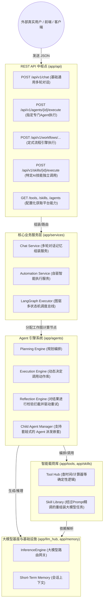

# AI Agent 智能体框架项目

这是一个高度模块化、基于 FastAPI 和 LangGraph 的全流程 AI Agent 智能体框架项目。从底层 LLM 接口适配，到独立工具库（Tools）、技能库（Skills）、工作流编排（Workflows），再到完整的任务规划（Planning）、执行（Execution）、反思（Reflection）和子节点委派，最终通过 RESTful API 提供 Chat Service 与 Automation Service。为了兼顾传统的存储与爬虫能力，本项目内部同样融合了完整的 SQLAlchemy + Alembic 关系型数据流驱动。

## ⚙️ 集成框架与技术栈

本项目主要基于 Python 3.13 并在 `pyproject.toml` 中通过 `poetry` 声明了以下核心集成框架：

1. **FastAPI (`fastapi`, `uvicorn`)**: 现代、快速的 Web 框架，用于构建提供外界调用的 RESTful API 端点。它基于标准的 Python 类型提示，提供自动文档生成（ Swagger UI ）和高性能并发响应。
2. **LangGraph (`langgraph`)**: 构建基于图模型的有状态、多 Action 的 Agent 执行环。它使得智能体的大脑（规划、执行武器库、自我推理纠错）形成一套可闭环的有向无环图流动。
3. **大模型 SDK适配 (`openai`, `anthropic`)**: 原生集成了主流大模型供应方的底层 SDK ，屏蔽底部各家大模型的协议差异。
4. **数据库与 ORM (`sqlalchemy`, `alembic`, `mysql-connector-python`)**: Python 乃至业界最成熟的 SQL 工具包和数据库迁移管理流，使得项目具备保存复杂上下文记录和历史兼容的 MySQL 表结构管理能力。
5. **基础工程化组件**:
   - **`pydantic`, `pydantic-settings`**: 数据验证和应用配置结构化管理。
   - **`python-dotenv`**: 环境变量自动加载。
   - **`httpx`**: 现代化的 HTTP 客户端，支持异步网络访问（常用于内部 Tool 中发起外部请求）。
   - **`cachetools`**: 简易高效的进程内缓存管理，极大地提高了接口对冷热数据的响应速度。
   - **`loguru`, `colorama`**: 现代化的日志处理与彩色控制台输出，为庞大的服务调用与 LLM 思维链执行提供极为清晰的中文溯源记录。

## 📂 项目结构描述

```
.
├── alembic/              # 数据库迁移相关文件
│   ├── env.py           # Alembic环境配置
│   ├── script.py.mako   # 迁移脚本模板
│   └── versions/        # 迁移版本文件
├── app/                  # 应用程序核心逻辑代码
│   ├── api/              # 对外暴露的 API路由端点集合 (入口)
│   │   └── endpoints/   # 具体的各类业务路由 (chat, agents, skills, workflows等)
│   ├── agents/           # 包含由多大模型驱动的引擎模块
│   │   ├── library/     # 预置的专家类型代理配置实例代码区
│   │   ├── planning.py, execution.py, reflection.py #核心步骤流引擎
│   ├── channels/         # 可扩展的多终端渠道适配接入模块层 
│   ├── config/           # 配置模块
│   ├── core/             # 系统核心设置与日志引擎 (Loguru) 初始化
│   ├── db/               # SQLAlchemy 数据库连接器与引擎
│   │── decorators/       # API 函数缓存等通用装饰器
│   ├── middleware/       # 拦截器与自定义异常处理器 (含报错美化格式转换)
│   ├── memory/           # 记忆力管理层 (如 短期多轮记忆上下文提取)
│   ├── models/           # 数据库模型对象 (ORM 映射定义)
│   ├── schemas/          # Pydantic 校验模型层 (统一通信数据结构)
│   ├── scripts/          # 用于不同环境下快捷切换 DB 与构建数据表的运维脚本
│   ├── services/         # 面向外部的业务总线层接口服务
│   ├── llm_hub/          # 底层 LLM 提供者核心工厂
│   │   ├── providers/   # 不同的厂商适配文件 (OpenAI, Anthropic 等)
│   │   ├── inference.py, prompt_builder.py # 通用大模型流式推理与提示词生成封装
│   ├── tools/            # Python 硬编码底层能力库封装框架
│   │   └── builtin/     # 内置计算器、爬虫、系统时间获取等真实工具代码执行区
│   ├── skills/           # 通过大语言模型做二次包装的高级技能库统筹 
│   │   ├── library/     # 存放执行技能具体的 Python 适配驱动逻辑
│   │   └── skills_md/   # 具有大模型特色的由 Prompt 定义的纯文档型技能包 (Markdown格式)
│   ├── workflows/        # 写死了拓扑链路和节点跳转条件的工作流集合
│   │   ├── templates/   # 存放在系统中供任意提取的通用工作流程拓扑结构图
│   └── main.py           # FastAPI 服务器核心入口
├── tests/                # 集成测试与全链路推演保障目录
├── pyproject.toml        # Poetry 依赖和元数据配置文件
├── run.sh                # 便捷的一键运行环境部署执行脚本
├── .env                  # 运行所需的所有核心环境变量注入点
└── run_app.py            # 面向本地调试和生产部署包装过的 Uvicorn 应用启动脚本
```

## 💡 核心全景架构

这里的架构图展现了工程中内部模块的层级调用和请求流向：



## 🚀 外界真实系统调用全流程解密

为了让企业应用、前端页面或微信小程序等使用者可以无缝与 Agent 对接，API 层被设计成了高度解耦的方法。当外界只想要简单的能力时可以走简单通道，想要复杂的反思推演逻辑时则会自动落入引擎管道内。

### 详细业务运转与调用图

以下序列图揭示了当一个自然语言提问抛过来时，整个系统是怎么协同配合帮用户得到解答的：


### 具体 API 端点调用说明

系统启动后，访问 `http://localhost:8002/docs` 可以看见全部自动生成的 OpenAPI Swagger 文档。下面列出了系统目前对外提供的**所有主要 API 端点**及它们的详细调用方法：

#### 一、 Chat 对话类接口 (最通用)
这类接口最适合大部分常规产品（如智能客服、微信机器人的自然语言接入），涵盖了记忆保持并且无需前端自己拆分逻辑。

1. **基础综合对话 (非流式)**
   - **请求端点**: `POST /api/v1/chat`
   - **作用介绍**: 给定当前 `conversation_id` 与提问，系统进行完整的思考、调用工具并一次性返回最终组装好的答案。
   - **请求体示例**: 
     ```json
     {
       "conversation_id": "user_12345", 
       "message": "你好，帮我查一下今天的日期并算一下 100 * 50", 
       "model": "deepseek-v3.2" 
     }
     ```
   
2. **打字机流式对话 (Streaming)**
   - **请求端点**: `POST /api/v1/chat/stream`
   - **作用介绍**: 与上面的基础对话逻辑完全一致，但响应格式为 Server-Sent Events (SSE) 流式返回。适合在网页前端实现“Token 逐字打印”的动态效果。
   - **请求体示例**: 同 `POST /api/v1/chat`。

3. **清空短期记忆上下文**
   - **请求端点**: `DELETE /api/v1/chat/{conversation_id}`
   - **作用介绍**: 主动遗忘特定 `conversation_id` 此前的多轮对话内容，开启全新的话题。无请求体。

#### 二、 Agent 代理引擎接口
当你不需要聊天，而是需要派发一个明确的**专业任务**给系统后台的某个特定专家 (Agent) 时使用。

4. **指定专家 Agent 执行深度任务**
   - **请求端点**: `POST /api/v1/agents/{agent_id}/execute`
   - **作用介绍**: 跳过通用对话外壳，直接唤起特定领域的 Agent（例如专做代码审计的 Agent，专做翻译的 Agent）处理长耗时任务。
   - **请求体示例**:
     ```json
     {
       "task": "请对该段代码 `print('hello')` 进行规范评审",
       "config": {"execution_model": "gpt-4"}
     }
     ```

5. **获取所有可用专家 Agent 列表**
   - **请求端点**: `GET /api/v1/agents`
   - **作用介绍**: 返回后端在 `AgentRegistry` 中注册的所有 Agent 详细信息，可用于前端构建“Agent 专家应用商店”。

6. **获取单个 Agent 详情**
   - **请求端点**: `GET /api/v1/agents/{agent_id}`
   - **作用介绍**: 查询某一个特型 Agent 的具体能力说明与默认配置。

#### 三、 Skill 技能库接口
有时不需要大模型复杂的 Planning（规划步骤），外部系统就是有一个明确的 “点击翻译此文” 按钮。可以通过此通道一键强制调用技能。

7. **强制孤立技能调用**
   - **请求端点**: `POST /api/v1/skills/{skill_id}/execute`
   - **作用介绍**: 明确跳过思考层，直接强制使用例如翻译、总结等独立技能，极大缩短响应等待时间。
   - **请求体示例** (以调用 `translation` 技能为例):
     ```json
     {
       "params": {
          "text": "Hello world",
          "target_language": "中文"
       }
     }
     ```

8. **获取所有可用技能列表**
   - **请求端点**: `GET /api/v1/skills`
   - **作用介绍**: 返回所有的组装技能定义模板，可用于丰富前端页面旁边的快捷工具箱栏目标签。

#### 四、 Tool 工具箱层接口
底层无脑工具（例如仅包含纯 Python 代码的计算器、获取系统时间）。

9. **获取所有硬编码原子工具列表**
   - **请求端点**: `GET /api/v1/tools`
   - **作用介绍**: 通常作为展示用途，看 LLM 具备哪些最底层的可调用原子长臂。

#### 五、 Workflow 工作流接口
具有固定模式、拓扑跳转和确定性步骤判断的工作流。

10. **执行定式业务流**
    - **请求端点**: `POST /api/v1/workflows/{workflow_id}/execute`
    - **作用介绍**: 根据已定义的蓝图模板开启一次执行。
    - **请求体示例**:
      ```json
      {
         "inputs": {
             "user_query": "我要投诉网络信号差"
         }
      }
      ```

11. **获取所有的工作流拓扑列表**
    - **请求端点**: `GET /api/v1/workflows`

#### 六、 微信公众号爬虫接口 (历史扩展遗留与辅助)
兼容旧版的文章结构与搜狗搜索功能能力。

12. **搜索公众号文章**: `GET /api/v1/wx/search?query=关键词`
13. **提交处理文章列表**: `POST /api/v1/wx/articles`
14. **获取单篇文章详情**: `POST /api/v1/wx/article/detail`

## 💻 安装和运行

### 1. 环境准备与依赖安装

强烈推荐使用 `poetry` 进行现代化的 Python 包环境初始化。

```bash
# 1. 克隆代码后，在项目根目录执行它，它会读取 pyproject.toml 中的要求:
poetry install

# 2. 激活并进入其自动生成的虚拟环境终端
poetry shell
```

### 2. 环境配置设置

你需要使用你的 LLM 服务提供商的 Key 才能正常启动大模型推理引擎。
复制一份环境模板文件并把它重命名：
```bash
cp .env.example .env
```
修改里面的核心变量：
```ini
API_PREFIX=/api/v1
ENVIRONMENT=development

# 核心：大模型驱动引擎所需的秘钥
OPENAI_API_KEY=sk-xxxxxxx
OPENAI_BASE_URL='https://apis.iflow.cn/v1'
DEFAULT_MODEL='deepseek-v3.2'

# 数据库等配置按需修改 (如果你要用到涉及 DB 的额外组件)
DB_DRIVER=mysql+mysqlconnector
DB_HOST=localhost
DB_PORT=3306
DB_NAME=wx_public_dev
# ...
```

### 3. 主项目启动
一切配置完成后，在虚拟环境中通过 Uvicorn 的包装脚本拉起 FastAPI 服务进程：

```bash
python run_app.py
```
> 服务出现 `Application startup complete.` 后，整个 Agent 暴露给你的 API 服务即会在本机 `http://localhost:8002` 下启动等待被客户端召唤。

## 💾 数据库与历史爬虫模型的配置与操作 (扩展功能)
由于项目兼顾历史对于微信公众号文章内容的收集流管理。若某些工作流必须开启保存或读库操作，数据库表是可选必需品。

### 创建数据库与表同步
系统根目录下的 `app/scripts` 准备了极其详尽的脚本环境：

```bash
# 1. 快捷建库（前提是你的 MySQL 服务本身要启动且密码账号没写错）
python -m app.scripts.create_database

# 2. 如果使用 Alembic 迁移脚本去同步初始化所有的字段到你的对应 DB：
# 首先生成本地的追踪表
python -m app.scripts.set_env dev migrate revision --autogenerate -m "创建初始结构"

# 最后提交至数据库实现执行
python -m app.scripts.set_env dev upgrade
```

## 许可证
MIT
