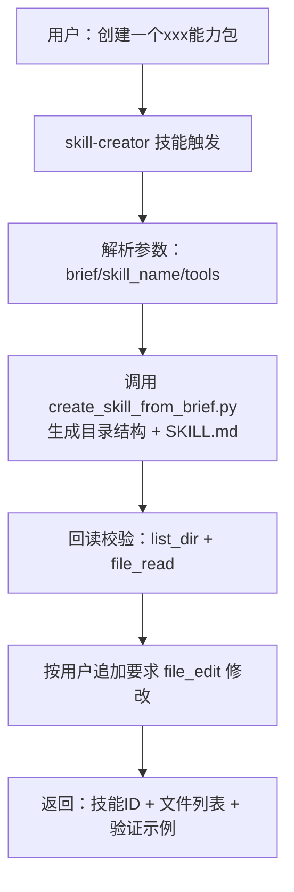

# AI Agent 技能系统综合分析报告

## 一、技能加载机制分析

### 1.1 三阶段架构（发现 → 路由 → 执行）

系统采用 **"发现 → 路由 → 懒加载执行"** 三级流水线：


| 阶段 | 入口 | 加载内容 | 性能开销 |
|:---|:---|:---|:---|
| **发现** | [discover_skills()](file:///Users/yuye/YeahWork/AIAgent%E9%A1%B9%E7%9B%AE/ai-agent/app/skills/manager.py#62-166) | YAML frontmatter + 章节标题 | 低，仅文件头 |
| **路由** | [_route_skills_by_metadata()](file:///Users/yuye/YeahWork/AIAgent%E9%A1%B9%E7%9B%AE/ai-agent/app/agents/langgraph_executor.py#454-615) | SkillMetadata（~100 token/技能） | 低，纯文本匹配 |
| **执行** | [load_skill()](file:///Users/yuye/YeahWork/AIAgent%E9%A1%B9%E7%9B%AE/ai-agent/app/skills/manager.py#179-250) + [execute_skill_runtime()](file:///Users/yuye/YeahWork/AIAgent%E9%A1%B9%E7%9B%AE/ai-agent/app/skills/manager.py#296-332) | 完整 Markdown Body + 脚本 + 资源 | 按需，仅选中技能 |

> [!TIP]
> 这套"渐进式信息披露"机制与 Claude Code 的三层加载一致：Metadata → Body → Resources。

### 1.2 双加载器并存问题

项目中存在 **两套独立的技能加载器**：

| 加载器 | 文件 | 用途 | 状态 |
|:---|:---|:---|:---|
| [SkillManager](file:///Users/yuye/YeahWork/AIAgent%E9%A1%B9%E7%9B%AE/ai-agent/app/skills/manager.py#33-619) | [manager.py](file:///Users/yuye/YeahWork/AIAgent%E9%A1%B9%E7%9B%AE/ai-agent/app/skills/manager.py) | 主链路（发现/路由/执行、声明式校验） | **生产主力** |
| [SkillsLoader](file:///Users/yuye/YeahWork/AIAgent%E9%A1%B9%E7%9B%AE/ai-agent/app/skills/skills.py#13-229) | [skills.py](file:///Users/yuye/YeahWork/AIAgent%E9%A1%B9%E7%9B%AE/ai-agent/app/skills/skills.py) | 参考实现（XML 导出、workspace 优先级） | **未使用/参考** |

> [!WARNING]
> [skills.py](file:///Users/yuye/YeahWork/AIAgent%E9%A1%B9%E7%9B%AE/ai-agent/app/skills/skills.py) 的 [SkillsLoader](file:///Users/yuye/YeahWork/AIAgent%E9%A1%B9%E7%9B%AE/ai-agent/app/skills/skills.py#13-229) 完全未被主链路集成，且其 frontmatter 解析逻辑（逐行 [split(":")](file:///Users/yuye/YeahWork/AIAgent%E9%A1%B9%E7%9B%AE/ai-agent/app/skills/skills_md/skill-creator/scripts/create_skill_from_brief.py#26-30)）在处理复杂 YAML 时易出错。建议要么统一合并进 [SkillManager](file:///Users/yuye/YeahWork/AIAgent%E9%A1%B9%E7%9B%AE/ai-agent/app/skills/manager.py#33-619)，要么标记 deprecated。

---

## 二、SKILL.md 书写格式分析

### 2.1 当前格式规范

所有 10 个技能遵循统一的 **YAML Frontmatter + 五段 Markdown Body** 结构：

```markdown
---
name: <skill_id>
description: <one-line 描述>
required_tools: [...]      # 可选
optional_tools: [...]      # 可选
tags: [...]                # 可选
output_validators: [...]   # 可选（声明式校验规则）
memory_include_short_term: true/false  # 可选
---
# 何时使用 (When to use)
# 输入参数 (Inputs)
# 执行指令 (Instructions)
# 脚本 (Scripts)
# 资源 (Resources)
```

### 2.2 各技能的格式一致性审计

| 技能 | frontmatter 完整度 | 五段章节 | output_validators | 评价 |
|:---|:---|:---|:---|:---|
| weather | ✅ 完整（tools/validators） | ✅ | ✅ 2 条规则 | **标杆** |
| text_writing | ✅ tags/memory | ✅ | ❌ | 建议补充 |
| tmux | ✅ tools | ✅ | ❌ | 合理（难校验输出） |
| data_analysis | ⚠️ 仅 name/description | ✅ | ❌ | 缺少 tools/tags |
| code_generation | ⚠️ 仅 name/description | ✅ | ❌ | 缺少 tools/tags |
| translation | ⚠️ 仅 name/description | ✅ | ❌ | 缺少 tools/tags |
| github | ✅ tools | ✅ | ❌ | 合理 |
| dynamic_probe | ✅ 完整 | ✅ | ❌ | 标杆级前置判定 |
| api-log-reporter | ✅ 完整 | ✅ | ❌ | 工具调用约束设计好 |
| skill-creator | ✅ 完整 | ✅ | ❌ | 合理 |

> **发现**：`data_analysis`、`code_generation`、`translation` 三个技能的 frontmatter 过于简略，缺少 `tags` 和 `required_tools`，影响路由精度和可用性检查。

---

## 三、与 Claude Code 主流技能设计对比

### 3.1 Claude Code 官方规范要点

根据 [.claude/skills/skill-creator/SKILL.md](file:///Users/yuye/YeahWork/AIAgent%E9%A1%B9%E7%9B%AE/ai-agent/.claude/skills/skill-creator/SKILL.md) 的官方指南：

| Claude 官方要求 | 本项目现状 | 匹配度 |
|:---|:---|:---|
| **frontmatter 只含 [name](file:///Users/yuye/YeahWork/AIAgent%E9%A1%B9%E7%9B%AE/ai-agent/tests/unit/test_execution_engine.py#25-28) + [description](file:///Users/yuye/YeahWork/AIAgent%E9%A1%B9%E7%9B%AE/ai-agent/app/agents/execution.py#595-612)** | 扩展了 `required_tools/tags/output_validators` 等 | ⚠️ 不一致但**更实用** |
| **[description](file:///Users/yuye/YeahWork/AIAgent%E9%A1%B9%E7%9B%AE/ai-agent/app/agents/execution.py#595-612) 是唯一触发机制**，"when to use" 应写入 description | [description](file:///Users/yuye/YeahWork/AIAgent%E9%A1%B9%E7%9B%AE/ai-agent/app/agents/execution.py#595-612) 一行简述 + Body 单独章节 | ⚠️ 本项目依赖 Body 章节路由 |
| **Body 不含"When to Use"章节**（仅在 frontmatter 触发后加载） | Body 有 `# 何时使用` 章节 | ⚠️ 不一致但**有合理原因** |
| **三级渐进披露**：Metadata → Body → Resources | ✅ 已实现相同三级结构 | ✅ 完全匹配 |
| **Resources 分为 scripts/references/assets** | 仅区分 scripts/resources | ⚠️ 粒度更粗 |
| **SKILL.md < 500 行** | ✅ 最长 99 行 | ✅ 远优于 |
| **package_skill.py 打包验证** | ❌ 未实现 | 缺失 |

### 3.2 核心差异的合理性分析

#### ✅ 合理偏离：frontmatter 扩展字段

```yaml
# Claude 官方：仅 name + description
name: weather
description: ...

# 本项目：扩展了路由和校验所需字段
name: weather
description: ...
required_tools: ["shell_exec"]
tags: ["weather"]
output_validators: [...]
```

**结论**：这些扩展字段服务于本项目的**代码侧规则预筛**（[_route_skills_by_metadata](file:///Users/yuye/YeahWork/AIAgent%E9%A1%B9%E7%9B%AE/ai-agent/app/agents/langgraph_executor.py#454-615)），是合理且有价值的扩展。Claude 官方依赖 LLM 自行判断触发，本项目用代码预筛 + LLM 二选减少幻觉。

#### ✅ 合理偏离：`# 何时使用` 章节保留

Claude 认为 Body 中的 "When to Use" 是浪费的（因为 Body 只在触发后才加载），但本项目在 [discover_skills](file:///Users/yuye/YeahWork/AIAgent%E9%A1%B9%E7%9B%AE/ai-agent/app/skills/manager.py#62-166) 阶段会**解析 Body 章节标题**提取 `when_to_use` 列表进入 SkillMetadata，用于路由评分。这是一个**兼顾可读性与功能性**的设计。

#### ⚠️ 需改进：[description](file:///Users/yuye/YeahWork/AIAgent%E9%A1%B9%E7%9B%AE/ai-agent/app/agents/execution.py#595-612) 信息密度不足

Claude 要求 [description](file:///Users/yuye/YeahWork/AIAgent%E9%A1%B9%E7%9B%AE/ai-agent/app/agents/execution.py#595-612) 包含所有触发信息，本项目部分技能的 description 过于简短：
- `translation`: "多语言翻译，保持原文风格并确保术语准确。"
- `code_generation`: "根据需求生成高质量代码，支持多种语言和框架。"

这些 description 缺乏**触发条件**和**使用场景**，仅靠 Body 的 `when_to_use` 章节补充。

---

## 四、技能创建流程分析

### 4.1 双创建流程并存

| 创建流程 | 位置 | 目标用户 | 状态 |
|:---|:---|:---|:---|
| **skill-creator 技能包**（本项目自有） | `app/skills/skills_md/skill-creator/` | Agent 自主创建新技能 | ✅ 生产可用 |
| **Claude 官方 skill-creator**（外部） | `.claude/skills/skill-creator/` | Claude Code 用户手动创建 | 参考/学习用 |

本项目的 skill-creator 已适配动态加载架构，支持 `output_validators` 声明，并调用 `create_skill_from_brief.py` 脚本自动生成骨架。

### 4.2 创建流程：



---

## 五、改进建议汇总

| # | 类别 | 问题 | 建议 |
|:---|:---|:---|:---|
| 1 | **格式一致性** | 3 个技能缺少 `tags`/`required_tools` | 补齐 frontmatter 字段 |
| 2 | **description 密度** | 部分技能 description 不含触发条件 | 参考 Claude 规范增加触发场景描述 |
| 3 | **双加载器冗余** | `skills.py` 未被使用 | 标记 deprecated 或合并功能 |
| 4 | **output_validators 覆盖** | 仅 weather 使用声明式校验 | 为更多技能添加校验规则 |
| 5 | **resources 细分** | 未区分 references/assets | 可参考 Claude 规范细化目录语义 |
| 6 | **打包验证脚本** | 缺少 package_skill.py | 后续需要时可补充自动化验证 |

---

## 六、总结

本项目的技能系统在 Claude Code 的 **YAML Frontmatter + Markdown Body + 渐进披露** 设计基础上，做了合理的工程化扩展：

- ✅ **加载机制**：三级加载（发现/路由/执行）设计优秀，与 Claude 一致
- ✅ **路由策略**：代码侧 IDF 预筛 + LLM 决策的混合模式，比纯 LLM 路由更稳定
- ✅ **声明式校验**：`output_validators` 是本项目的特色扩展，值得推广到更多技能
- ✅ **创建流程**：skill-creator 技能包已适配动态架构，可自主创建新技能
- ⚠️ **格式一致性**：部分技能的 frontmatter 信息不完整，需补充
- ⚠️ **双加载器冗余**：`skills.py` 应标记 deprecated
